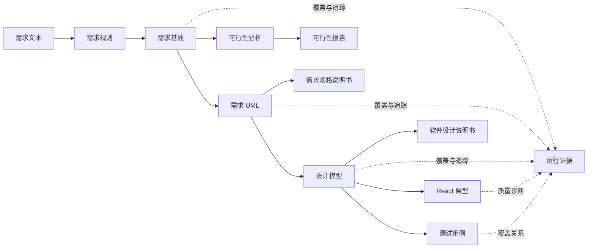

<p align="center">
  <a href="https://jianglisoftware.com">
    
  </a>
</p>

<div align="center">

# 软件工程实践平台

<p>
  <strong>AI 辅助 UML 建模、可信追踪与前端原型生成工作台</strong><br />
  从需求基线、可行性分析、UML 模型到 React 原型、测试与三类说明书<br />
  <sub>PlantUML 渲染 × 可信链路 × 通用 Skill Runtime</sub>
</p>

<p>
  <a href="https://jianglisoftware.com"></a>
  <a href="https://jianglisoftware.com/tutorial"></a>
  <a href="./LICENSE"></a>
</p>

<p>
  
  
  
  
</p>

> 把系统需求、可行性研究、UML、设计模型、前端原型、测试和说明书沉淀为可追踪、可验证、可修复的工程产物。

</div>

## 项目简介

软件工程实践平台面向软件工程课程、实验和项目原型验证。它不是一次性的模型调用页面，而是一套阶段化工作台：先确认需求事实，再生成模型与设计，最后形成代码、测试、文档及可复盘证据。

| 🧭 端到端阶段 | 🔗 可信机制 | 📦 可交付产物 |
| --- | --- | --- |
| 需求 → 可行性 → UML → 设计 → 代码 → 测试 → 文档 | 基线、运行历史、覆盖矩阵、追踪矩阵、人工确认 | SVG、React 原型、测试用例、DOCX、证据记录 |

### 为什么做这个平台

- **让生成有依据**：下游产物引用已确认需求和上游元素，不把模型输出当作天然正确。
- **让失败可定位**：生成阶段、事件、错误、修复记录和渲染结果都能在任务历史中追踪。
- **让成果可交付**：模型、原型、测试和说明书位于同一项目上下文中，减少人工搬运。
- **让模型可替换**：支持经过安全校验的 OpenAI 兼容 Provider，不把业务流程绑定到单一模型。

## 在线访问

| 入口 | 地址 | 用途 |
| --- | --- | --- |
| 🌐 平台首页 | [jianglisoftware.com](https://jianglisoftware.com) | 了解产品并进入工作台 |
| 📖 使用手册 | [在线教程](https://jianglisoftware.com/tutorial) | 查询页面入口、前置条件和操作步骤 |
| 💚 服务状态 | [健康检查](https://jianglisoftware.com/api/health) | 检查 API 是否正常运行 |

## 核心能力

| 能力 | 说明 | 主要产物 |
| --- | --- | --- |
| 📝 需求基线 | 从需求文本抽取规则，处理质量提示与人工确认 | `RequirementBaseline` |
| 🧭 可行性分析 | 建立系统上下文，比较实现方案、成本收益与风险 | 上下文图、候选方案、研究报告 |
| 📐 需求 UML | 生成并校验需求阶段的结构与行为模型 | PlantUML、SVG、模型元素 |
| 🏗️ 设计建模 | 从需求模型推导架构、类、交互、界面与数据设计 | 设计模型、设计图、元素详情 |
| 🔗 追踪与覆盖 | 连接需求、设计、代码、测试和说明书 | 覆盖矩阵、追踪矩阵、链路图 |
| 💻 代码原型 | 抽取业务逻辑并生成可预览 React 原型 | TypeScript、CSS、运行预览 |
| 🧪 测试设计 | 根据需求与设计生成测试场景并检查覆盖 | 测试用例、覆盖关系 |
| 📄 文档交付 | 生成、在线编辑、版本化并下载三类说明书 | DOCX、文档版本 |
| 🤖 模型管理 | 发现、测试和选择个人或托管 Provider 模型 | Provider 配置、模型目录 |
| 📡 任务中心 | 展示排队、运行、完成、失败、重试与恢复 | 运行事件、快照、错误证据 |

### 可信边界

平台适合课程实验、普通业务系统与原型验证。它能显式暴露缺失覆盖、低置信映射和生成失败，但不承诺在安全关键、强监管或完全无人复核的场景中自动给出正确结论。正式交付前仍需领域评审、真实运行验收与针对项目的测试证据。

## 界面预览

<p align="center"><strong>从公开首页到项目交付，六个关键界面</strong></p>

### 🌐 平台首页


### 📂 项目首页


### 📝 需求分析工作台


### 🧭 可行性分析工作台


### 💻 前端原型与预览


### 📄 三类说明书


## 技术架构

### 生成链路



### Monorepo 组成

```text
uml-experimental-platform/
├── apps/
│   ├── api/             # Fastify API、生成流水线、文档与外部适配器
│   ├── render-service/  # PlantUML SVG/PNG 渲染服务
│   └── web/             # React + Vite 用户界面
├── packages/
│   ├── contracts/       # 前后端共享契约
│   ├── prompts/         # 生成提示与结构约束
│   ├── harness-e2e/     # 端到端验收
│   └── harness-eval/    # 质量评估
├── docs/                # 架构、部署、开发与集成文档
├── scripts/             # 审计、开发、部署与维护脚本
└── plantuml/            # 生产与 CI 使用的 PlantUML JAR
```

| 层级 | 技术 | 边界 |
| --- | --- | --- |
| Web | React、Vite、TypeScript、Tailwind CSS、Radix UI、Sandpack | 页面组合、业务交互、领域展示与远端调用 |
| API | Fastify、Zod、PostgreSQL、Redis/BullMQ | 契约、认证、生成流水线、记录与文档组装 |
| 渲染 | Java、PlantUML、Graphviz | 隔离渲染与运行时诊断 |
| 文档 | `docx`、OnlyOffice | DOCX 生成、版本、在线编辑与下载 |
| 部署 | GitHub Actions、PM2、Nginx | 测试、构建、原子 release 与健康检查 |

详细设计见[平台架构](docs/architecture/platform-overview.md)和[可信生成链路](docs/architecture/trusted-generation.md)。

## 快速开始

### 1. 准备环境

| 依赖 | 建议版本 | 用途 |
| --- | --- | --- |
| Node.js | 22 | 应用与工具链运行时 |
| npm | 10 | Monorepo 依赖与脚本 |
| Java | 21 | PlantUML 运行时 |
| Graphviz | 当前稳定版 | PlantUML 图布局 |
| Docker Desktop | 可选 | 本地 OnlyOffice 在线编辑 |

### 2. 获取并安装

```bash
git clone <repository-url>
cd uml-experimental-platform
npm ci
```

### 3. 启动完整开发环境

```bash
npm run dev
```

启动脚本会检查本地 OnlyOffice，并并行启动 Web、API 和渲染服务。

| 服务 | 本地地址或端口 |
| --- | --- |
| Web | Vite 输出地址，通常为 `http://localhost:5173` |
| API | 安全开发配置使用 `4101` |
| Render Service | `4002` |
| OnlyOffice | `8080` |

### 4. 配置模型服务

登录后在账号设置中新增 OpenAI 兼容 Provider，填写供应商 HTTPS Base URL 与 API Key，完成模型发现和连接测试后选择默认模型。生产环境应使用服务端托管配置，并关闭 legacy 明文回退入口。

## 常用命令

### 开发与构建

| 命令 | 用途 |
| --- | --- |
| `npm run dev` | 启动完整本地开发环境 |
| `npm run dev:api:safe` | 以安全开发配置单独启动 API |
| `npm run dev:render` | 单独启动 PlantUML 渲染服务 |
| `npm run dev:web:safe` | 以安全开发配置单独启动 Web |
| `npm run build` | 构建共享包和全部应用 |
| `npm run build:web:production` | 按生产站点配置构建 Web |

### 测试与治理

| 命令 | 用途 |
| --- | --- |
| `npm run test:contracts` | 验证共享契约 |
| `npm run test:api` | 运行 API 测试 |
| `npm run test:render` | 运行渲染服务测试 |
| `npm run test:web` | 运行完整 Web 测试 |
| `npm run test:harness-e2e` | 运行端到端验收 |
| `npm run typecheck:web` | 检查 Web 类型 |
| `npm run audit:architecture` | 检查架构边界 |
| `npm run audit:docs` | 检查文档命名、结构、链接和杂物 |

> `apps/web/public/sandpack/` 由 Web 预开发和预构建脚本自动生成并保持 Git 忽略，无需手工提交。

## 文档导航

| 分类 | 文档 | 内容 |
| --- | --- | --- |
| 📚 总览 | [文档索引](docs/README.md) | 当前有效文档的统一入口 |
| 🏛️ 架构 | [平台架构](docs/architecture/platform-overview.md) | 组件边界、调用链与运行依赖 |
| 🔗 架构 | [可信生成链路](docs/architecture/trusted-generation.md) | 基线、证据、覆盖与人工责任 |
| 🚀 部署 | [宝塔与 PM2](docs/deployment/baota-pm2.md) | GitHub Actions 与生产发布 |
| ⚙️ 部署 | [生产环境配置](docs/deployment/production-environment.md) | 环境变量、凭据边界与验证 |
| 📡 部署 | [生成任务 Worker](docs/deployment/generation-workers.md) | 队列、并发、重试与恢复 |
| 🔍 部署 | [SEO 运维](docs/deployment/seo.md) | 预渲染与公开页面检查 |
| 🤖 集成 | [OpenAI 兼容 Provider](docs/integrations/openai-compatible-provider.md) | 接口合同与安全限制 |
| 🧹 开发 | [仓库治理规范](docs/development/repository-hygiene.md) | 文档、生成目录与临时产物规则 |
| 📖 用户 | [应用内快速开始](apps/web/src/features/product-docs/content/quick-start.md) | 从项目创建到成果交付 |

## 授权

<div align="center">

**Copyright © 2026 软件工程实践平台 · All rights reserved**

本项目为专有软件，不授予开源许可。未经权利人事先书面许可，不得复制、修改、发布、分发、再许可、销售或制作衍生作品。完整条款见 [LICENSE](LICENSE)。

</div>
