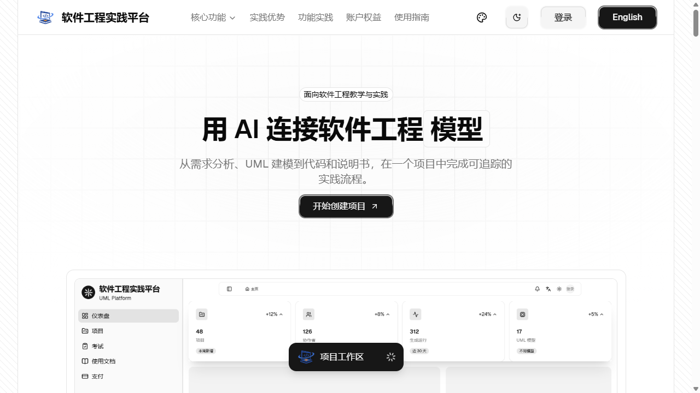
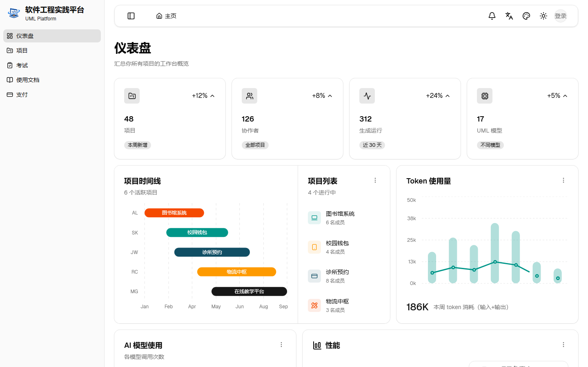
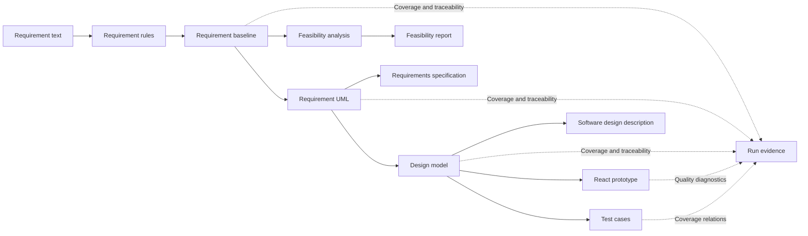

**English** | [简体中文](./readme-zh-cn.md)

<p align="center">
  <a href="https://jianglisoftware.com">
    
  </a>
</p>

<div align="center">

# Software Engineering Practice Platform

<p>
  <strong>An AI-assisted workspace for UML modeling, trusted traceability, and frontend prototype generation</strong><br />
  From requirement baselines, feasibility studies, and UML models to React prototypes, tests, and engineering documents<br />
  <sub>PlantUML rendering × trusted generation chains × general-purpose Skill Runtime</sub>
</p>

<p>
  <a href="https://jianglisoftware.com"></a>
  <a href="https://jianglisoftware.com/tutorial"></a>
  <a href="./LICENSE"></a>
</p>

<p>
  
  
  
  
  
</p>

> Turn system requirements, feasibility studies, UML models, design artifacts, frontend prototypes, tests, and documents into traceable, verifiable, and repairable engineering deliverables.

</div>

## Overview

The Software Engineering Practice Platform is designed for software engineering courses, laboratory exercises, and project prototyping. It is not a one-shot model invocation page. Instead, it provides a staged workspace that establishes confirmed requirement facts before generating models and designs, then produces code, tests, documents, and reviewable evidence.

| 🧭 End-to-end stages | 🔗 Trust mechanisms | 📦 Deliverables |
| --- | --- | --- |
| Requirements → Feasibility → UML → Design → Code → Tests → Documents | Baselines, run history, coverage matrices, traceability matrices, human confirmation | SVG, React prototypes, test cases, DOCX files, evidence records |

### Why this platform exists

- **Ground generation in evidence:** downstream artifacts reference confirmed requirements and upstream elements instead of treating model output as inherently correct.
- **Make failures diagnosable:** generation stages, events, errors, repair records, and rendering results remain traceable in task history.
- **Produce usable deliverables:** models, prototypes, tests, and documents share the same project context, reducing manual transfer work.
- **Keep models replaceable:** securely validated OpenAI-compatible providers can be used without binding the workflow to a single model vendor.

> The current product interface and online tutorial are primarily available in Simplified Chinese. This README provides an English technical overview for international readers and contributors.

### v2.0 highlights

- **A rebuilt product shell:** the responsive AdminCN workspace, project dashboard, navigation, account pages, and authentication flow now share one accessible component and theme system.
- **Visible generation activity:** durable run activity events power a recoverable task conversation with streamed output, public reasoning summaries, parallel-call attribution, and terminal-state replay.
- **Sharper engineering workflows:** model cards, editors, traceability, code preview, project administration, and document guidance are aligned around the same project state and action guards.
- **A refreshed public experience:** the Flow landing page, localized content, light/dark palettes, pricing entry points, and in-app tutorial use the current product visuals.

## Online Access

| Destination | Address | Purpose |
| --- | --- | --- |
| 🌐 Platform | [jianglisoftware.com](https://jianglisoftware.com) | Explore the product and enter the workspace |
| 📖 User guide | [Online tutorial](https://jianglisoftware.com/tutorial) | Review page entry points, prerequisites, and operating steps (Simplified Chinese) |
| 💚 Service status | [Health check](https://jianglisoftware.com/api/health) | Verify that the API is available |

## Core Capabilities

| Capability | Description | Primary artifacts |
| --- | --- | --- |
| 📝 Requirement baseline | Extract rules from requirement text, surface quality issues, and record human confirmation | `RequirementBaseline` |
| 🧭 Feasibility analysis | Model the system context and compare implementation options, costs, benefits, and risks | Context diagram, candidate solutions, study report |
| 📐 Requirement UML | Generate and validate structural and behavioral models for the requirement stage | PlantUML, SVG, model elements |
| 🏗️ Design modeling | Derive architecture, classes, interactions, interfaces, and data designs from requirement models | Design models, diagrams, element details |
| 🔗 Traceability and coverage | Connect requirements, designs, code, tests, and documents | Coverage matrix, traceability matrix, lineage graph |
| 💻 Code prototype | Extract business logic and generate a previewable React prototype | TypeScript, CSS, runtime preview |
| 🧪 Test design | Generate test scenarios from requirements and designs, then evaluate coverage | Test cases, coverage relations |
| 📄 Document delivery | Generate, edit online, version, and download three types of engineering documents | DOCX files, document versions |
| 🤖 Model management | Discover, test, and select personal or managed provider models | Provider configurations, model catalog |
| 📡 Task center | Track queued, running, completed, failed, retried, and recovered jobs | Run events, snapshots, error evidence |

### Trust boundary

The platform is intended for coursework, conventional business systems, and prototype validation. It exposes missing coverage, low-confidence mappings, and generation failures, but it does not guarantee correct results for safety-critical, heavily regulated, or fully unattended scenarios. Production delivery still requires domain review, real-world acceptance testing, and project-specific test evidence.

## Interface Preview

<p align="center"><strong>Current v2 homepage and project dashboard in light mode</strong></p>

### 🌐 Official homepage



### 📊 Project dashboard



## Architecture

### Generation flow



### Monorepo layout

```text
uml-experimental-platform/
├── apps/
│   ├── api/             # Fastify API, generation pipelines, documents, and external adapters
│   ├── render-service/  # PlantUML SVG/PNG rendering service
│   └── web/             # React + Vite user interface
├── packages/
│   ├── contracts/       # Shared frontend and backend contracts
│   ├── prompts/         # Generation prompts and structural constraints
│   ├── harness-e2e/     # End-to-end acceptance harness
│   └── harness-eval/    # Quality evaluation harness
├── docs/                # Architecture, deployment, development, and integration documentation
├── scripts/             # Audit, development, deployment, and maintenance scripts
└── plantuml/            # PlantUML JAR used in production and CI
```

| Layer | Technology | Responsibility boundary |
| --- | --- | --- |
| Web | React, Vite, TypeScript, Tailwind CSS, Radix UI, Sandpack | Page composition, business interaction, domain presentation, and remote calls |
| API | Fastify, Zod, PostgreSQL, Redis/BullMQ | Contracts, authentication, generation pipelines, records, and document assembly |
| Rendering | Java, PlantUML, Graphviz | Isolated rendering and runtime diagnostics |
| Documents | `docx`, OnlyOffice | DOCX generation, versioning, online editing, and downloads |
| Deployment | GitHub Actions, PM2, Nginx | Testing, builds, atomic releases, and health checks |

For more detail, see the [platform architecture](docs/architecture/platform-overview.md) and [trusted generation flow](docs/architecture/trusted-generation.md). These supporting documents are currently maintained in Simplified Chinese.

## Quick Start

### 1. Prepare the environment

| Dependency | Recommended version | Purpose |
| --- | --- | --- |
| Node.js | 22 | Application and toolchain runtime |
| npm | 10 | Monorepo dependency and script management |
| Java | 21 | PlantUML runtime |
| Graphviz | Current stable release | PlantUML graph layout |
| Docker Desktop | Optional | Local OnlyOffice editing |

### 2. Clone and install

```bash
git clone <repository-url>
cd uml-experimental-platform
npm ci
```

### 3. Start the complete development environment

```bash
npm run dev
```

The startup script checks the local OnlyOffice service, then launches the Web app, API, and rendering service in parallel.

| Service | Local address or port |
| --- | --- |
| Web | The address reported by Vite, usually `http://localhost:5173` |
| API | Port `4101` under the safe development configuration |
| Render Service | `4002` |
| OnlyOffice | `8080` |

### 4. Configure a model provider

After signing in, add an OpenAI-compatible provider in account settings. Enter the provider's HTTPS base URL and API key, complete model discovery and the connection test, then select a default model. Production environments should use server-managed configurations and disable the legacy plaintext fallback.

## Common Commands

### Development and builds

| Command | Purpose |
| --- | --- |
| `npm run dev` | Start the complete local development environment |
| `npm run dev:api:safe` | Start only the API with the safe development configuration |
| `npm run dev:render` | Start only the PlantUML rendering service |
| `npm run dev:web:safe` | Start only the Web app with the safe development configuration |
| `npm run build` | Build shared packages and all applications |
| `npm run build:web:production` | Build the Web app with production site settings |

### Testing and governance

| Command | Purpose |
| --- | --- |
| `npm run test:contracts` | Validate shared contracts |
| `npm run test:api` | Run API tests |
| `npm run test:render` | Run rendering service tests |
| `npm run test:web` | Run the complete Web test suite |
| `npm run test:harness-e2e` | Build production Web bundles and run local browser acceptance checks |
| `npm run typecheck:web` | Type-check the Web application |
| `npm run audit:architecture` | Validate architecture boundaries |
| `npm run audit:docs` | Validate documentation names, structure, links, and repository hygiene |

> `apps/web/public/sandpack/` is generated by the Web pre-development and pre-build scripts and remains Git-ignored. Do not commit it manually.

## Release and Deployment

The product version is maintained in the root package and released with a matching semantic tag. A merge into `main` triggers the production GitHub Actions workflow, which tests and builds the monorepo before creating an atomic PM2 release. After production health and SEO checks pass, the deployed merge commit is tagged `v2.0.0` and published as a GitHub Release. Reproducible build archives are not attached to the release.

## Documentation

| Category | Document | Coverage |
| --- | --- | --- |
| 📚 Overview | [Documentation index](docs/README.md) | Central index of currently maintained documentation |
| 🏛️ Architecture | [Platform architecture](docs/architecture/platform-overview.md) | Component boundaries, call flow, and runtime dependencies |
| 🔗 Architecture | [Trusted generation flow](docs/architecture/trusted-generation.md) | Baselines, evidence, coverage, and human responsibility |
| 🚀 Deployment | [BaoTa and PM2](docs/deployment/baota-pm2.md) | GitHub Actions and production releases |
| ⚙️ Deployment | [Production environment](docs/deployment/production-environment.md) | Environment variables, credential boundaries, and validation |
| 📡 Deployment | [Generation workers](docs/deployment/generation-workers.md) | Queues, concurrency, retries, and recovery |
| 🔍 Deployment | [SEO operations](docs/deployment/seo.md) | Prerendering and public-page checks |
| 🤖 Integration | [OpenAI-compatible providers](docs/integrations/openai-compatible-provider.md) | Interface contract and security constraints |
| 🧹 Development | [Repository hygiene](docs/development/repository-hygiene.md) | Documentation, generated directories, and temporary artifact rules |
| 📖 User guide | [In-app quick start](apps/web/src/features/product-docs/content/quick-start.md) | From project creation to deliverable generation |

The linked supporting documentation is currently written primarily in Simplified Chinese.

## License

<div align="center">

**Copyright © 2026 Software Engineering Practice Platform · All rights reserved**

This repository contains proprietary software and does not grant an open-source license. No part may be copied, modified, published, distributed, sublicensed, sold, or used to create derivative works without prior written permission from the rights holder. See [LICENSE](LICENSE) for the complete terms.

</div>
