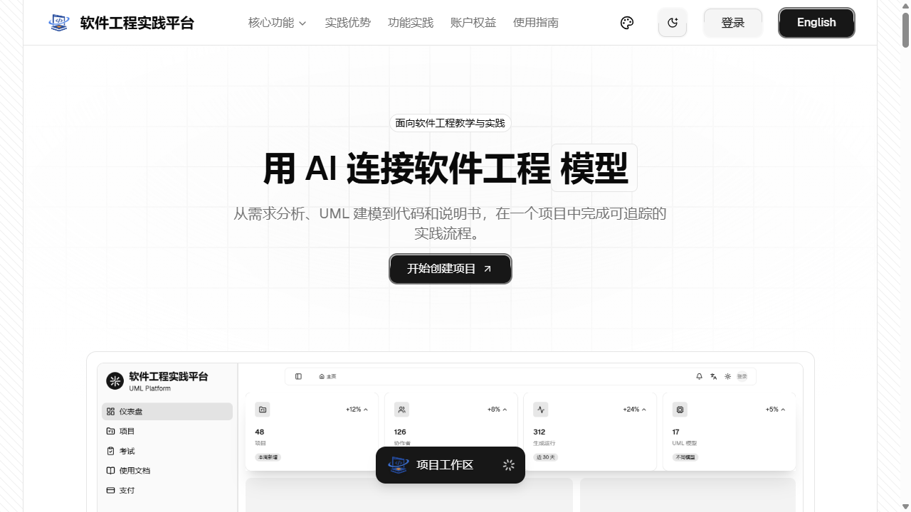
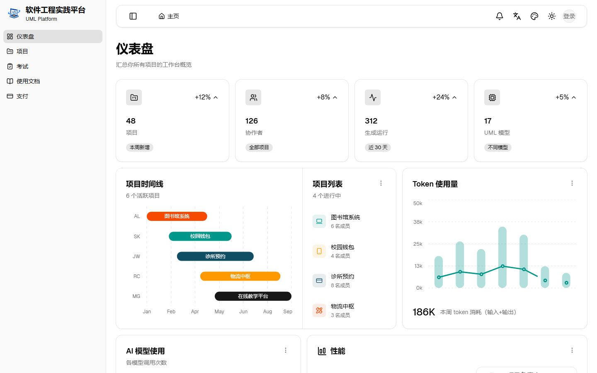
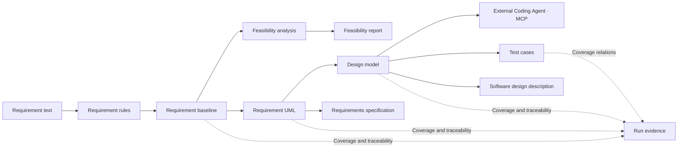

**English** | [简体中文](./readme-zh-cn.md)

<p align="center">
  <a href="https://jianglisoftware.com">
    
  </a>
</p>

<div align="center">

# Software Engineering Practice Platform

<p>
  <strong>AI-assisted UML modeling and project context for any MCP-compatible Coding Agent</strong><br />
  From requirement baselines, feasibility studies, and UML models to external Coding Agents, tests, and engineering documents<br />
  <sub>PlantUML rendering × trusted generation chains × MCP Streamable HTTP</sub>
</p>

<p>
  <a href="https://jianglisoftware.com"></a>
  <a href="https://jianglisoftware.com/tutorial"></a>
  <a href="./LICENSE"></a>
</p>

<p>
  
  
  
  
  
</p>

> Turn system requirements, feasibility studies, UML models, design artifacts, tests, and documents into traceable engineering deliverables, and supply their implementation context to external Coding Agents.

</div>

## Overview

The Software Engineering Practice Platform is designed for software engineering courses, laboratory exercises, and project development. Its staged workspace establishes confirmed requirement facts before generating models and designs, then produces tests, documents, and reviewable evidence. Any Coding Agent that supports MCP Streamable HTTP and the platform's authentication can read saved project sources to implement and test code in the student's own repository and technology stack. Integration is not limited to the clients listed on the connection page.

| 🧭 End-to-end stages | 🔗 Trust mechanisms | 📦 Deliverables |
| --- | --- | --- |
| Requirements → Feasibility → UML → Design → Tests → Documents | Baselines, run history, coverage matrices, traceability matrices, human confirmation | SVG, MCP project sources, test cases, DOCX files, evidence records |

### Why this platform exists

- **Ground generation in evidence:** downstream artifacts reference confirmed requirements and upstream elements instead of treating model output as inherently correct.
- **Make failures diagnosable:** generation stages, events, errors, repair records, and rendering results remain traceable in task history.
- **Produce usable deliverables:** models, implementation context, tests, and documents share the same project sources, reducing manual transfer work.
- **Keep models replaceable:** securely validated OpenAI-compatible providers can be used without binding the workflow to a single model vendor.

> The current product interface and online tutorial are primarily available in Simplified Chinese. This README provides an English technical overview for international readers and contributors.

### v2.0 highlights

- **A rebuilt product shell:** the responsive AdminCN workspace, project dashboard, navigation, account pages, and authentication flow now share one accessible component and theme system.
- **Visible generation activity:** durable run activity events power a recoverable task conversation with streamed output, public reasoning summaries, parallel-call attribution, and terminal-state replay.
- **Sharper engineering workflows:** model cards, editors, traceability, project administration, and document guidance are aligned around the same project state and action guards.
- **Bring your own Coding Agent:** connect any client supporting MCP Streamable HTTP and the platform's authentication to read saved requirements, structured models, PlantUML sources, dependencies, rules, and source versions.
- **A refreshed public experience:** the Flow landing page, localized content, light/dark palettes, pricing entry points, and in-app tutorial use the current product visuals.

## Online Access

| Destination | Address | Purpose |
| --- | --- | --- |
| 🌐 Platform | [jianglisoftware.com](https://jianglisoftware.com) | Explore the product and enter the workspace |
| 📖 User guide | [Online tutorial](https://jianglisoftware.com/tutorial) | Review page entry points, prerequisites, and operating steps (Simplified Chinese) |
| 💚 Service status | [Health check](https://jianglisoftware.com/api/health) | Verify that the API is available |

## Core Capabilities

| Capability | Description | Primary artifacts |
| --- | --- | --- |
| 📝 Requirement baseline | Extract rules from requirement text, surface quality issues, and record human confirmation | `RequirementBaseline` |
| 🧭 Feasibility analysis | Model the system context and compare implementation options, costs, benefits, and risks | Context diagram, candidate solutions, study report |
| 📐 Requirement UML | Generate and validate structural and behavioral models for the requirement stage | PlantUML, SVG, model elements |
| 🏗️ Design modeling | Derive architecture, classes, interactions, interfaces, and data designs from requirement models | Design models, diagrams, element details |
| 🔗 Traceability and coverage | Connect requirements, designs, tests, and documents | Coverage matrix, traceability matrix, lineage graph |
| 💻 Coding Agent | Authorize external agents to read saved project sources over MCP | Implementation context, artifact versions, connection records |
| 🧪 Test design | Generate test scenarios from requirements and designs, then evaluate coverage | Test cases, coverage relations |
| 📄 Document delivery | Generate, edit online, version, and download three types of engineering documents | DOCX files, document versions |
| 🤖 Model management | Discover, test, and select personal or managed provider models | Provider configurations, model catalog |
| 📡 Task center | Track queued, running, completed, failed, retried, and recovered jobs | Run events, snapshots, error evidence |

### Trust boundary

The platform is intended for coursework, conventional business systems, and prototype validation. It exposes missing coverage, low-confidence mappings, and generation failures, but it does not guarantee correct results for safety-critical, heavily regulated, or fully unattended scenarios. Production delivery still requires domain review, real-world acceptance testing, and project-specific test evidence.

## Interface Preview

<p align="center"><strong>Current v2 homepage and project dashboard in light mode</strong></p>

### 🌐 Official homepage



### 📊 Project dashboard



## Architecture

### Generation flow


```mermaid
flowchart LR
  A["Requirement text"] --> B["Requirement rules"]
  B --> C["Requirement baseline"]
  C --> D["Feasibility analysis"]
  C --> E["Requirement UML"]
  E --> F["Design model"]
  F --> G["External Coding Agent · MCP"]
  F --> H["Test cases"]
  D --> I["Feasibility report"]
  E --> J["Requirements specification"]
  F --> K["Software design description"]
  C -.Coverage and traceability.-> L["Run evidence"]
  E -.Coverage and traceability.-> L
  F -.Coverage and traceability.-> L
  H -.Coverage relations.-> L
```

### Monorepo layout

```text
uml-experimental-platform/
├── apps/
│   ├── api/             # Fastify API, generation pipelines, documents, and external adapters
│   ├── render-service/  # PlantUML SVG/PNG rendering service
│   └── web/             # React + Next.js user interface
├── packages/
│   ├── contracts/       # Shared frontend and backend contracts
│   ├── prompts/         # Generation prompts and structural constraints
│   ├── harness-e2e/     # End-to-end acceptance harness
│   └── harness-eval/    # Quality evaluation harness
├── docs/                # Architecture, deployment, development, and integration documentation
├── scripts/             # Audit, development, deployment, and maintenance scripts
└── plantuml/            # PlantUML JAR used in production and CI
```

| Layer | Technology | Responsibility boundary |
| --- | --- | --- |
| Web | React, Next.js, TypeScript, Tailwind CSS, shadcn/ui | Page composition, business interaction, domain presentation, and remote calls |
| API | Fastify, Zod, PostgreSQL, Redis/BullMQ | Contracts, authentication, generation pipelines, records, and document assembly |
| Rendering | Java, PlantUML, Graphviz | Isolated rendering and runtime diagnostics |
| Documents | `docx`, OnlyOffice | DOCX generation, versioning, online editing, and downloads |
| Deployment | GitHub Actions, PM2, Nginx | Testing, builds, atomic releases, and health checks |

For more detail, see the [platform architecture](docs/architecture/platform-overview.md) and [trusted generation flow](docs/architecture/trusted-generation.md). These supporting documents are currently maintained in Simplified Chinese.

## Quick Start

### 1. Prepare the environment

| Dependency | Recommended version | Purpose |
| --- | --- | --- |
| Node.js | 22 | Application and toolchain runtime |
| npm | 10 | Monorepo dependency and script management |
| Java | 21 | PlantUML runtime |
| Graphviz | Current stable release | PlantUML graph layout |
| Docker Desktop | Optional | Local OnlyOffice editing |

### 2. Clone and install

```bash
git clone <repository-url>
cd uml-experimental-platform
npm ci
```

### 3. Start the complete development environment

```bash
npm run dev
```

The startup script checks the local OnlyOffice service, then launches the Web app, API, and rendering service in parallel.

| Service | Local address or port |
| --- | --- |
| Web | The address reported by Next.js, usually `http://localhost:3000` |
| API | Port `4101` under the safe development configuration |
| Render Service | `4002` |
| OnlyOffice | `8080` |

### 4. Configure a model provider

After signing in, add an OpenAI-compatible provider in account settings. Enter the provider's HTTPS base URL and API key, complete model discovery and the connection test, then select a default model. Production environments should use server-managed configurations and disable the legacy plaintext fallback.

### 5. Try Coding Agent integration

The MCP server uses **Streamable HTTP**. Any compatible Coding Agent can use the endpoint with OAuth or a personal token; the listed client configurations are starting points. Your agent implements and tests code in your own repository using your chosen technology stack.

For the PostgreSQL demo with MCP enabled, run `npm run dev:postgres:demo`. The command checks service ports and verifies the Web, API, rendering, and OAuth discovery paths before reporting success. Docker Desktop or compatible existing PostgreSQL and OnlyOffice services are required. The local MCP address is `http://localhost:3000/api/mcp`.

Sign in and open **Coding Agent** in the project-list sidebar (`/projects/connections`). Use the client's desktop connection form when available; CLI configuration examples are also provided. OAuth prompts the student to select projects. Clients that support an authorization header can use a personal token, subject to the account's current project permissions.

The four read-only tools are `list_projects`, `get_implementation_context`, `get_artifact`, and `check_context_updates`. They provide saved requirements, acceptance criteria, structured models, PlantUML, dependencies, existing tests, and version information. The agent edits and tests local code; MCP does not generate code, return diagram images, or receive implementation results. Explicit technology requirements are preserved without inheriting the retired prototype generator's framework restrictions.

Client-specific versions and generated-code acceptance remain pending. See the [MCP integration guide](docs/integrations/coding-agent-mcp.md) for configuration, source consistency, and acceptance steps.

## Common Commands

### Development and builds

| Command | Purpose |
| --- | --- |
| `npm run dev` | Start the complete local development environment |
| `npm run dev:postgres:demo` | Start the PostgreSQL demo with MCP and readiness checks |
| `npm run dev:api:safe` | Start only the API with the safe development configuration |
| `npm run dev:render` | Start only the PlantUML rendering service |
| `npm run dev:web:safe` | Start only the Web app with the safe development configuration |
| `npm run build` | Build shared packages and all applications |
| `npm run build:web:production` | Build the Web app with production site settings |

### Testing and governance

| Command | Purpose |
| --- | --- |
| `npm run test:contracts` | Validate shared contracts |
| `npm run test:api` | Run API tests |
| `npm run test:render` | Run rendering service tests |
| `npm run test:web` | Run the complete Web test suite |
| `npm run test:harness-e2e` | Build production Web bundles and run local browser acceptance checks |
| `npm run typecheck:web` | Type-check the Web application |
| `npm run test:deploy` | Validate deployment helpers and MCP proxy routing |
| `npm run audit:architecture` | Validate architecture boundaries |
| `npm run audit:docs` | Validate documentation names, structure, links, and repository hygiene |

> Build outputs, generated documentation modules, root `.local-*` scratch files, environment files, private keys, logs, and local runtime data remain Git-ignored. Commit MCP source files, contracts, tests, deployment helpers, and `package-lock.json` together.

## Release and Deployment

Pushes to `main` trigger the [production deployment workflow](.github/workflows/deploy.yml); it also supports manual runs. The workflow checks documentation, runs tests, builds the applications, and transfers the committed Git revision to the server for a PM2 release. The product version is maintained in the root package. Semantic tags and GitHub Releases are separate from deployment.

### MCP production configuration

MCP shares the API process and port. Store production configuration in `shared/production.env` outside release directories, with permissions `600`. Configure `MCP_ENABLED=true`, HTTPS `MCP_PUBLIC_ORIGIN` and `MCP_WEB_ORIGIN`, a stable random `MCP_SHARED_SECRET` of at least 32 characters, and `MCP_JWKS` containing a private signing JWK set. Share these values across all API instances. Optional pre-registered clients and trusted client-metadata origins use `MCP_OAUTH_CLIENTS` and `MCP_CIMD_ORIGINS`. Never commit private values or add them to client configuration.

The deployment script loads this environment file; the ecosystem configuration passes MCP settings to the API, and the Nginx routing helper forwards MCP/OAuth discovery to it. A configured server still needs the release containing the MCP module and PostgreSQL migrations. Use `https://<your-domain>/api/mcp` as the remote HTTP connection address; no additional public port is needed.

After deployment, verify that `/.well-known/oauth-protected-resource/api/mcp` and `/.well-known/oauth-authorization-server/api/mcp/oauth` return JSON with the correct public resource and issuer. Verify authorization and all four tools in a real client. A general API health check alone does not verify MCP.

This release also includes `030_retire_code_prototypes`, which deletes retired prototype data. Back up PostgreSQL and follow the [migration procedure](docs/deployment/production-environment.md#移除旧代码功能时的发布顺序) before the first production upgrade. Returning to an earlier code release does not restore deleted database data.

## Documentation

| Category | Document | Coverage |
| --- | --- | --- |
| 📚 Overview | [Documentation index](docs/README.md) | Central index of currently maintained documentation |
| 🏛️ Architecture | [Platform architecture](docs/architecture/platform-overview.md) | Component boundaries, call flow, and runtime dependencies |
| 🔗 Architecture | [Trusted generation flow](docs/architecture/trusted-generation.md) | Baselines, evidence, coverage, and human responsibility |
| 🚀 Deployment | [BaoTa and PM2](docs/deployment/baota-pm2.md) | GitHub Actions and production releases |
| ⚙️ Deployment | [Production environment](docs/deployment/production-environment.md) | Environment variables, credential boundaries, and validation |
| 📡 Deployment | [Generation workers](docs/deployment/generation-workers.md) | Queues, concurrency, retries, and recovery |
| 🔍 Deployment | [SEO operations](docs/deployment/seo.md) | Prerendering and public-page checks |
| 🤖 Integration | [OpenAI-compatible providers](docs/integrations/openai-compatible-provider.md) | Interface contract and security constraints |
| 💻 Integration | [Coding Agent MCP](docs/integrations/coding-agent-mcp.md) | Tools, authorization, client setup, and acceptance boundaries |
| 🧹 Development | [Repository hygiene](docs/development/repository-hygiene.md) | Documentation, generated directories, and temporary artifact rules |
| 📖 User guide | [In-app quick start](apps/web/src/features/product-docs/content/quick-start.md) | From project creation to deliverable generation |

The linked supporting documentation is currently written primarily in Simplified Chinese.

## License

<div align="center">

**Copyright © 2026 Software Engineering Practice Platform · All rights reserved**

This repository contains proprietary software and does not grant an open-source license. No part may be copied, modified, published, distributed, sublicensed, sold, or used to create derivative works without prior written permission from the rights holder. See [LICENSE](LICENSE) for the complete terms.

</div>
