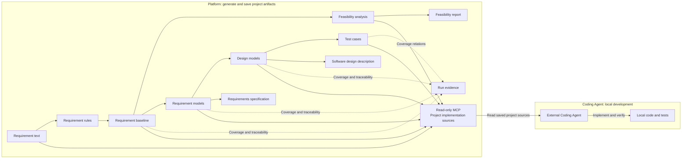
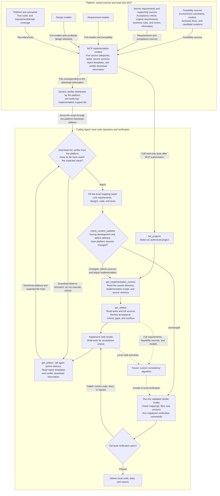

**English** | [简体中文](./readme-zh-cn.md)

<p align="center">
  <a href="https://jianglisoftware.com">
    
  </a>
</p>

<div align="center">

# Software Engineering Practice Platform

<p>
  <strong>Turn requirements into UML models, and trace them through designs and tests</strong><br />
  An AI-assisted workspace for reviewing requirement rules, diagrams, coverage, and engineering documents<br />
  <sub>PlantUML source and SVG · traceability matrices · DOCX export</sub>
</p>

<p>
  <a href="https://jianglisoftware.com"></a>
  <a href="https://jianglisoftware.com/tutorial"></a>
  <a href="./LICENSE"></a>
</p>

<p>
  
  
  
  
  
</p>

> Start with a requirement, inspect the generated models, and check how designs and tests relate to the original rules.

</div>

## Follow a seat-reservation example

Use this input, translated from the [quick-start guide](apps/web/src/features/product-docs/content/quick-start.md), to explore the workflow:

```text
Students can sign in, find available library seats, and reserve a seat for a selected date and time slot.
A student cannot make duplicate reservations for the same time slot. The system sends a notification after a successful reservation.
Administrators can manage seats, review reservation records, and handle exceptional cancellations.
```

| Step | What to inspect |
| --- | --- |
| Confirm the requirements | Check the extracted rules and repair suggestions, including the duplicate-reservation rule. |
| Generate requirement models | Start with use cases and domain concepts; inspect their elements, PlantUML, SVG, and links to requirement rules. |
| Continue with designs and tests | Follow the prerequisite prompts, then check design traceability and test coverage against the confirmed rules. |
| Prepare deliverables | Generate the applicable DOCX documents, review their diagrams and text, and download them. Use task history to investigate failures. |

Start with the [online platform](https://jianglisoftware.com) and [user guide](https://jianglisoftware.com/tutorial). A real generation run requires a configured, available model. This is an input walkthrough; configured offline demo projects use fixed example data rather than live model output.

**Workspace interface illustration:** the dashboard below contains sample figures that illustrate the layout. They are not live usage metrics or the recorded results of this example.


If this workflow is useful to you, star the repository to bookmark it and follow future improvements.

## Overview

The Software Engineering Practice Platform is an AI-assisted workspace for software engineering courses and project development. Confirm requirement rules, generate UML and design models, inspect their traceability, and produce test cases and engineering documents. Generated results remain subject to human review.

The repository also implements a read-only MCP interface for supplying saved requirements, feasibility sources, requirement and design models, and existing tests to external Coding Agents. Engineering documents remain available through the platform's document tools and are excluded from MCP context. Real-client compatibility and generated-code acceptance testing remain pending; see the [MCP integration guide](docs/integrations/coding-agent-mcp.md).

| 🧭 End-to-end stages | 🔗 Trust mechanisms | 📦 Deliverables |
| --- | --- | --- |
| Requirements → Feasibility → UML → Design → Tests → Documents | Baselines, run history, coverage matrices, traceability matrices, human confirmation | SVG, MCP project sources, test cases, DOCX files, evidence records |

### Why this platform exists

- **Ground generation in evidence:** downstream artifacts reference confirmed requirements and upstream elements instead of treating model output as inherently correct.
- **Make failures diagnosable:** generation stages, events, errors, repair records, and rendering results remain traceable in task history.
- **Produce usable deliverables:** models, implementation context, tests, and documents share the same project sources, reducing manual transfer work.
- **Keep models replaceable:** securely validated OpenAI-compatible providers can be used without binding the workflow to a single model vendor.

> The current product interface and online tutorial are primarily available in Simplified Chinese. This README provides an English technical overview for international readers.

### v2.0 highlights

- **A rebuilt product shell:** the responsive AdminCN workspace, project dashboard, navigation, account pages, and authentication flow now share one accessible component and theme system.
- **Visible generation activity:** durable run activity events power a recoverable task conversation with streamed output, public reasoning summaries, parallel-call attribution, and terminal-state replay.
- **Sharper engineering workflows:** model cards, editors, traceability, project administration, and document guidance are aligned around the same project state and action guards.
- **Provide context to Coding Agents:** the read-only MCP implementation exposes saved requirements, feasibility sources, requirement and design models, PlantUML, existing tests, dependencies, and source versions. Client-specific authorization and tool calls still require validation.
- **A refreshed public experience:** the Flow landing page, localized content, light/dark palettes, pricing entry points, and in-app tutorial use the current product visuals.

## Online Access

| Destination | Address | Purpose |
| --- | --- | --- |
| 🌐 Platform | [jianglisoftware.com](https://jianglisoftware.com) | Explore the product and enter the workspace |
| 📖 User guide | [Online tutorial](https://jianglisoftware.com/tutorial) | Review page entry points, prerequisites, and operating steps (Simplified Chinese) |
| 💚 Service status | [Health check](https://jianglisoftware.com/api/health) | Verify that the API is available |

## Core Capabilities

| Capability | Description | Primary artifacts |
| --- | --- | --- |
| 📝 Requirement baseline | Extract rules from requirement text, surface quality issues, and record human confirmation | `RequirementBaseline` |
| 🧭 Feasibility analysis | Model the system context and compare implementation options, costs, benefits, and risks | Context diagram, candidate solutions, study report |
| 📐 Requirement UML | Generate and validate structural and behavioral models for the requirement stage | PlantUML, SVG, model elements |
| 🏗️ Design modeling | Derive architecture, classes, interactions, interfaces, and data designs from requirement models | Design models, diagrams, element details |
| 🔗 Traceability and coverage | Connect requirements, designs, tests, and documents | Coverage matrix, traceability matrix, lineage graph |
| 💻 Coding Agent | Authorize external agents to read saved requirements, feasibility sources, models, and tests over MCP | Implementation context, artifact versions, connection records |
| 🧪 Test design | Generate test scenarios from requirements and designs, then evaluate coverage | Test cases, coverage relations |
| 📄 Document delivery | Generate, edit online, version, and download three types of engineering documents | DOCX files, document versions |
| 🤖 Model management | Discover, test, and select personal or managed provider models | Provider configurations, model catalog |
| 📡 Task center | Track queued, running, completed, failed, retried, and recovered jobs | Run events, snapshots, error evidence |

### Trust boundary

The platform is intended for coursework, conventional business systems, and prototype validation. It exposes missing coverage, low-confidence mappings, and generation failures, but it does not guarantee correct results for safety-critical, heavily regulated, or fully unattended scenarios. Production delivery still requires domain review, real-world acceptance testing, and project-specific test evidence.

## Interface Preview

<p align="center"><strong>Current v2 homepage in light mode</strong></p>

### 🌐 Official homepage


## Architecture

### Generation flow


```mermaid
flowchart LR
  subgraph platform["Platform: generate and save project artifacts"]
    A["Requirement text"] --> B["Requirement rules"]
    B --> C["Requirement baseline"]
    C --> D["Feasibility analysis"]
    C --> E["Requirement models"]
    E --> F["Design models"]
    F --> H["Test cases"]
    D --> I["Feasibility report"]
    E --> J["Requirements specification"]
    F --> K["Software design description"]
    C -.Coverage and traceability.-> L["Run evidence"]
    E -.Coverage and traceability.-> L
    F -.Coverage and traceability.-> L
    H -.Coverage relations.-> L
    A --> M["Read-only MCP<br/>Project implementation sources"]
    C --> M
    D --> M
    E --> M
    F --> M
    H --> M
  end

  subgraph agent["Coding Agent: local development"]
    G["External Coding Agent"] -->|"Implement and verify"| N["Local code and tests"]
  end

  M -->|"Read saved project sources"| G
```

The external Coding Agent reads requirements, feasibility sources, requirement models, design models, and existing tests through read-only MCP, then implements and verifies code in its local repository. MCP arrows represent source reads; connection does not require completing all design models, and the three engineering-document types are excluded. The next diagram details task, code, and test mappings.

### Requirement, design, and code mapping

The platform shows five parallel source categories: feasibility sources, atomic requirements and supporting sources, requirement models, design models, and platform test scenarios. These categories feed the MCP implementation context; generation dependencies appear in the preceding diagram. The Coding Agent section shows the four read-only tools in their usage order, followed by local implementation, mapping reports, and verification. Solid arrows show existing source delivery, tool calls, and local operations; dotted arrows show a future custom consistency algorithm. Local code, reports, and verification results are not written back through MCP.


```mermaid
flowchart TB
  subgraph platform["Platform: saved sources and read-only MCP"]
    feasibility["Feasibility sources<br/>Environment constraints, context,<br/>business flows, and candidate solutions"]
    req["Atomic requirements and supporting sources<br/>Acceptance criteria, original requirements,<br/>business rules, and review information"]
    requirementModels["Requirement models"]
    design["Design models"]
    savedTests["Platform test scenarios<br/>Test cases and requirement/design coverage"]
    bundle["MCP implementation context<br/>Five source categories, tasks, source versions,<br/>report templates, and verifier download information"]
    feasibility -->|"Feasibility sources"| bundle
    req -->|"Requirements and acceptance sources"| bundle
    requirementModels -->|"Full models and traceability"| bundle
    design -->|"Full models and candidate design elements"| bundle
    savedTests -->|"Test references"| bundle
    verifierFile["Generic verifier distributed by the platform<br/>uml-verify.mjs: implementation support file"]
    bundle -->|"File corresponding to the download information"| verifierFile
  end

  subgraph agent["Coding Agent: local code repository and verification"]
    projects["list_projects<br/>Select an authorized project"]
    catalog["get_implementation_context<br/>Read the source directory,<br/>implementation scope, and source versions"]
    sources["get_artifact<br/>Read tasks and full sources<br/>Review acceptance criteria, gaps, and conflicts"]
    implementation["Implement code locally<br/>Write tests for acceptance criteria"]
    delivery["get_artifact: call again before delivery<br/>Read report templates<br/>and verifier download information"]
    download{"Download the verifier from the platform<br/>Does its file hash match the expected value?"}
    mapping["Fill the local mapping report<br/>Link requirements, designs, code, and tests"]
    updates{"check_context_updates<br/>During development and before delivery:<br/>have platform sources changed?"}
    validator["Run the validated verifier locally<br/>Check mappings, files, and versions<br/>Run registered verification commands"]
    result{"Did local verification pass?"}
    done["Deliver local code, tests, and reports"]
    algorithm["Future: custom consistency algorithm"]
    projects --> catalog
    catalog --> sources
    sources --> implementation
    implementation --> delivery
    delivery -->|"Download address and expected file hash"| download
    download -->|"Match"| mapping
    download -->|"Download failed or mismatch: do not execute; refresh"| delivery
    mapping --> updates
    updates -->|"Changed: refresh sources and adjust implementation"| catalog
    updates -->|"Unchanged"| validator
    validator --> result
    result -->|"Failed: correct code, tests, or reports"| implementation
    result -->|"Passed"| done
    sources -.->|"Full requirements, feasibility sources, and models"| algorithm
    implementation -.->|"Local code and tests"| algorithm
    algorithm -.->|"Include in local verification"| validator
  end

  bundle -->|"Call read-only tools after MCP authorization"| projects
  verifierFile -->|"Serve the script through the platform download address"| download
```

The five source nodes are parallel categories; arrows identify inputs to the MCP implementation context rather than a generation sequence. Atomic requirements and supporting sources include atomic requirements with their acceptance criteria, plus saved original requirements, business rules, assumptions, conflicts, and quality-review information.

The four tools select a project, read its source directory and versions, read full artifacts, and check for updates. Read all directory pages and required content chunks; if versions change during reading, return to the directory and refresh. Before delivery, use the same artifact-reading tool again for report templates and verifier download information. Downloading the verifier, filling reports, editing code, and executing commands are local agent operations. Source changes or verification failures require updating the affected implementation and reports, then rerunning verification. Passing confirms the registered checks and commands for that run; semantic coverage still requires review.

The platform maintains the verifier and distributes it through a fixed HTTP download address. It is a generic implementation support script, separate from the five project-source categories. MCP returns its download address and expected file hash; the agent downloads `uml-verify.mjs`, checks its SHA-256, and executes it locally only when they match. Failed downloads or hash mismatches prevent execution and a passing claim. Downloading the script does not add a fifth MCP tool or send local code to the platform for execution.

Feasibility sources enter the implementation context as supporting evidence: user-saved environment and resource constraints guide implementation, system context and business flows link through requirement traceability, and candidate technology choices still require confirmation. This arrow represents source transfer; it does not mean feasibility analysis automatically generates requirement models or mandates a technology stack. The platform supplies tasks and report templates; the agent selects design elements and fills the local report based on its actual implementation.

The borrowing integration test associates the following evidence through one task:

| Mapping | Example |
| --- | --- |
| Requirement | No more than 5 books borrowed at once |
| Design element | `LoanService` |
| Actual code | `LoanService` in `src/loan-service.mjs`, with its file hash |
| Acceptance tests | Allow the fifth book, reject the sixth without changing the count, restore capacity after a return |
| Version evidence | Requirement and design source versions, plus hashes of code, tests, and registered inputs |

**Associations are currently many-to-many within a task.** A task can register several requirements, design elements, and code locations; there is no explicit pairwise binding from each design element to a particular code symbol. The report records which acceptance criteria each test addresses, but semantic coverage still requires independent validation.

A future consistency algorithm can check requirement coverage in designs, design structures and constraints in code, and runtime behavior against requirements. The existing local verification workflow can execute custom validation commands. Per-rule pass/fail/unknown results, algorithm versions, and pairwise bindings remain extensions to implement; an unknown result should not count as a pass.

Mappings provide traceability; algorithms and executed tests provide evidence of correctness. The borrowing regression covers invalidation when the limit changes from 5 to 8 and subsequent code and test updates. It does not establish acceptance of a complete project generated by a real Coding Agent. See the [mapping example](docs/integrations/coding-agent-mcp.md#映射示例与证据边界) and [custom algorithm integration](docs/integrations/coding-agent-mcp.md#接入自定义一致性算法) in the Chinese integration guide.

### Monorepo layout

```text
ai-software-engineering-platform/
├── apps/
│   ├── api/             # Fastify API, generation pipelines, documents, and external adapters
│   ├── render-service/  # PlantUML SVG/PNG rendering service
│   └── web/             # React + Next.js user interface
├── packages/
│   ├── contracts/       # Shared frontend and backend contracts
│   ├── prompts/         # Generation prompts and structural constraints
│   ├── harness-e2e/     # End-to-end acceptance harness
│   └── harness-eval/    # Quality evaluation harness
├── docs/                # Architecture, deployment, development, and integration documentation
├── scripts/             # Audit, development, deployment, and maintenance scripts
└── plantuml/            # PlantUML JAR used in production and CI
```

| Layer | Technology | Responsibility boundary |
| --- | --- | --- |
| Web | React, Next.js, TypeScript, Tailwind CSS, shadcn/ui | Page composition, business interaction, domain presentation, and remote calls |
| API | Fastify, Zod, PostgreSQL, Redis/BullMQ | Contracts, authentication, generation pipelines, records, and document assembly |
| Rendering | Java, PlantUML, Graphviz | Isolated rendering and runtime diagnostics |
| Documents | `docx`, OnlyOffice | DOCX generation, versioning, online editing, and downloads |
| Deployment | GitHub Actions, PM2, Nginx | Testing, builds, atomic releases, and health checks |

For more detail, see the [platform architecture](docs/architecture/platform-overview.md) and [trusted generation flow](docs/architecture/trusted-generation.md). These supporting documents are currently maintained in Simplified Chinese.

## Quick Start

### 1. Prepare the environment

| Dependency | Recommended version | Purpose |
| --- | --- | --- |
| Node.js | 22 | Application and toolchain runtime |
| npm | 10 | Monorepo dependency and script management |
| Java | 21 | PlantUML runtime |
| Graphviz | Current stable release | PlantUML graph layout |
| Docker Desktop | Optional | Local OnlyOffice editing |

### 2. Clone and install

```bash
git clone https://github.com/guolola/ai-software-engineering-platform.git
cd ai-software-engineering-platform
npm ci
```

### 3. Start the complete development environment

```bash
npm run dev
```

The startup script checks the local OnlyOffice service, then launches the Web app, API, and rendering service in parallel.

| Service | Local address or port |
| --- | --- |
| Web | The address reported by Next.js, usually `http://localhost:3000` |
| API | Port `4101` under the safe development configuration |
| Render Service | `4002` |
| OnlyOffice | `8080` |

### 4. Configure a model provider

After signing in, add an OpenAI-compatible provider in account settings. Enter the provider's HTTPS base URL and API key, complete model discovery and the connection test, then select a default model. Production environments should use server-managed configurations and disable the legacy plaintext fallback.

### 5. Try Coding Agent integration

The MCP implementation uses **Streamable HTTP** with OAuth or personal-token authentication. It is intended for compatible clients; the listed configurations are starting points, not a verified support list. The external agent is responsible for implementing and testing code in your repository using your chosen technology stack.

For the PostgreSQL demo with MCP enabled, run `npm run dev:postgres:demo`. The command checks service ports and verifies the Web, API, rendering, and OAuth discovery paths before reporting success. Docker Desktop or compatible existing PostgreSQL and OnlyOffice services are required. The local MCP address is `http://localhost:3000/api/mcp`.

Sign in and open **Coding Agent** in the project-list sidebar (`/projects/connections`). Use the client's desktop connection form when available; CLI configuration examples are also provided. OAuth prompts the student to select projects. Clients that support an authorization header can use a personal token, subject to the account's current project permissions.

The four read-only tools are `list_projects`, `get_implementation_context`, `get_artifact`, and `check_context_updates`. They provide saved requirements, acceptance criteria, feasibility sources, structured requirement and design models, PlantUML, dependencies, existing tests, and version information. Implementation bundles, report templates, and local-verifier download metadata support code and test traceability in the agent's repository. The agent edits and tests local code; MCP does not generate code, return diagram images, or receive implementation results. Explicit technology requirements are preserved without inheriting the retired prototype generator's framework restrictions.

MCP does not read or transmit engineering documents, their text, or DOCX files. Documents are excluded from implementation-task sources and source-version checks. Document generation, online editing, versioning, and downloads remain available in the platform. Clients with previously saved document references should refresh their context; `check_context_updates` reports those sources as deleted.

Client-specific versions and generated-code acceptance remain pending. See the [MCP integration guide](docs/integrations/coding-agent-mcp.md) for configuration, source consistency, and acceptance steps.

## Common Commands

### Development and builds

| Command | Purpose |
| --- | --- |
| `npm run dev` | Start the complete local development environment |
| `npm run dev:postgres:demo` | Start the PostgreSQL demo with MCP and readiness checks |
| `npm run dev:api:safe` | Start only the API with the safe development configuration |
| `npm run dev:render` | Start only the PlantUML rendering service |
| `npm run dev:web:safe` | Start only the Web app with the safe development configuration |
| `npm run build` | Build shared packages and all applications |
| `npm run build:web:production` | Build the Web app with production site settings |

### Testing and governance

| Command | Purpose |
| --- | --- |
| `npm run test:contracts` | Validate shared contracts |
| `npm run test:api` | Run API tests |
| `npm run test:render` | Run rendering service tests |
| `npm run test:web` | Run the complete Web test suite |
| `npm run test:harness-e2e` | Build production Web bundles and run local browser acceptance checks |
| `npm run typecheck:web` | Type-check the Web application |
| `npm run test:deploy` | Validate deployment helpers and MCP proxy routing |
| `npm run audit:architecture` | Validate architecture boundaries |
| `npm run audit:docs` | Validate documentation names, structure, links, and repository hygiene |

> Build outputs, generated documentation modules, root `.local-*` scratch files, environment files, private keys, logs, and local runtime data remain Git-ignored. Commit MCP source files, contracts, tests, deployment helpers, and `package-lock.json` together.

## Release and Deployment

Pushes to `main` trigger the [production deployment workflow](.github/workflows/deploy.yml); it also supports manual runs. The workflow checks documentation, runs tests, builds the applications, and transfers the committed Git revision to the server for a PM2 release. The product version is maintained in the root package. Semantic tags and GitHub Releases are separate from deployment.

### MCP production configuration

MCP shares the API process and port. Store production configuration in `shared/production.env` outside release directories, with permissions `600`. Configure `MCP_ENABLED=true`, HTTPS `MCP_PUBLIC_ORIGIN` and `MCP_WEB_ORIGIN`, a stable random `MCP_SHARED_SECRET` of at least 32 characters, and `MCP_JWKS` containing a private signing JWK set. Share these values across all API instances. Optional pre-registered clients and trusted client-metadata origins use `MCP_OAUTH_CLIENTS` and `MCP_CIMD_ORIGINS`. Never commit private values or add them to client configuration.

The deployment script loads this environment file; the ecosystem configuration passes MCP settings to the API, and the Nginx routing helper forwards MCP/OAuth discovery to it. A configured server still needs the release containing the MCP module and PostgreSQL migrations. Use `https://<your-domain>/api/mcp` as the remote HTTP connection address; no additional public port is needed.

After deployment, verify that `/.well-known/oauth-protected-resource/api/mcp` and `/.well-known/oauth-authorization-server/api/mcp/oauth` return JSON with the correct public resource and issuer. Verify authorization and all four tools in a real client. A general API health check alone does not verify MCP.

This release also includes `030_retire_code_prototypes`, which deletes retired prototype data. Back up PostgreSQL and follow the [migration procedure](docs/deployment/production-environment.md#移除旧代码功能时的发布顺序) before the first production upgrade. Returning to an earlier code release does not restore deleted database data.

## Documentation

| Category | Document | Coverage |
| --- | --- | --- |
| 📚 Overview | [Documentation index](docs/README.md) | Central index of currently maintained documentation |
| 🏛️ Architecture | [Platform architecture](docs/architecture/platform-overview.md) | Component boundaries, call flow, and runtime dependencies |
| 🔗 Architecture | [Trusted generation flow](docs/architecture/trusted-generation.md) | Baselines, evidence, coverage, and human responsibility |
| 🚀 Deployment | [BaoTa and PM2](docs/deployment/baota-pm2.md) | GitHub Actions and production releases |
| ⚙️ Deployment | [Production environment](docs/deployment/production-environment.md) | Environment variables, credential boundaries, and validation |
| 📡 Deployment | [Generation workers](docs/deployment/generation-workers.md) | Queues, concurrency, retries, and recovery |
| 🔍 Deployment | [SEO operations](docs/deployment/seo.md) | Prerendering and public-page checks |
| 🤖 Integration | [OpenAI-compatible providers](docs/integrations/openai-compatible-provider.md) | Interface contract and security constraints |
| 💻 Integration | [Coding Agent MCP](docs/integrations/coding-agent-mcp.md) | Tools, authorization, client setup, and acceptance boundaries |
| 🧹 Development | [Repository hygiene](docs/development/repository-hygiene.md) | Documentation, generated directories, and temporary artifact rules |
| 📖 User guide | [In-app quick start](apps/web/src/features/product-docs/content/quick-start.md) | From project creation to deliverable generation |

The linked supporting documentation is currently written primarily in Simplified Chinese.

## License

<div align="center">

**Copyright © 2026 Software Engineering Practice Platform · All rights reserved**

This repository contains proprietary software and does not grant an open-source license. No part may be copied, modified, published, distributed, sublicensed, sold, or used to create derivative works without prior written permission from the rights holder. See [LICENSE](LICENSE) for the complete terms.

</div>
