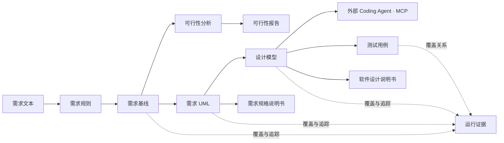
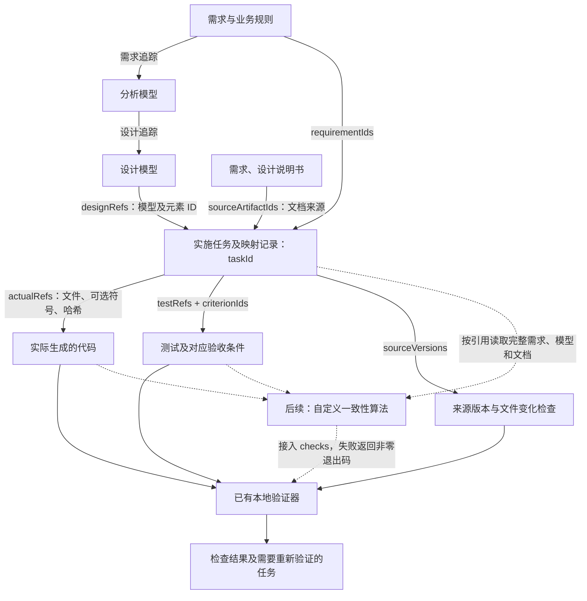

<!-- 提供仓库首页的简体中文版本，并与默认英文 README 保持内容同步。 -->

[English](./README.md) | **简体中文**

<p align="center">
  <a href="https://jianglisoftware.com">
    
  </a>
</p>

<div align="center">

# 软件工程实践平台

<p>
  <strong>从需求生成 UML，并追踪到设计与测试</strong><br />
  在同一工作台检查需求规则、图表、覆盖关系与工程说明书<br />
  <sub>PlantUML 源码与 SVG · 追踪矩阵 · DOCX 导出</sub>
</p>

<p>
  <a href="https://jianglisoftware.com"></a>
  <a href="https://jianglisoftware.com/tutorial"></a>
  <a href="./LICENSE"></a>
</p>

<p>
  
  
  
  
  
</p>

> 从一段需求开始，检查生成的模型，再核对设计和测试是否关联到原始需求规则。

</div>

## 跟着座位预约案例走一遍

使用[快速开始教程](apps/web/src/features/product-docs/content/quick-start.md)中的这段输入体验流程：

```text
图书馆预约系统允许学生登录后查询空闲座位，选择日期和时间段提交预约。
同一学生同一时间段不能重复预约。预约成功后，系统向学生发送通知。
管理员可以维护座位、查看预约记录，并处理异常取消。
```

| 步骤 | 检查什么 |
| --- | --- |
| 确认需求 | 检查抽取的需求规则和修复建议，包括“同一时间段不可重复预约”。 |
| 生成需求模型 | 先生成用例模型与领域概念模型，检查元素、PlantUML、SVG 及对应的需求规则。 |
| 继续设计与测试 | 按提示补齐前置条件，检查设计追踪关系与测试覆盖是否关联到已确认的规则。 |
| 整理交付产物 | 按前置条件生成 DOCX 说明书，检查图表和正文后下载；失败时通过任务历史定位原因。 |

可以从[在线平台](https://jianglisoftware.com)和[使用手册](https://jianglisoftware.com/tutorial)开始。真实生成需要配置可用模型。这里展示的是输入与操作路径；配置为离线演示的项目使用固定示例数据。

**工作台界面示意：** 下图使用示例数字展示布局，不代表真实使用量，也不是本案例的一次实际生成结果。


如果这个流程对你有帮助，可以点 Star 收藏仓库，关注后续改进。

## 项目简介

软件工程实践平台面向软件工程课程与项目开发：确认需求规则，生成 UML 和设计模型，检查追踪关系，再形成测试用例与工程说明书。生成结果仍需人工评审。

仓库同时实现了只读 MCP 接口，可向外部 Coding Agent 提供已保存的项目依据。真实客户端兼容性与生成代码验收仍待完成，详见 [MCP 接入说明](docs/integrations/coding-agent-mcp.md)。

| 🧭 端到端阶段 | 🔗 可信机制 | 📦 可交付产物 |
| --- | --- | --- |
| 需求 → 可行性 → UML → 设计 → 测试 → 文档 | 基线、运行历史、覆盖矩阵、追踪矩阵、人工确认 | SVG、MCP 实现依据、测试用例、DOCX、证据记录 |

### 为什么做这个平台

- **让生成有依据**：下游产物引用已确认需求和上游元素，不把模型输出当作天然正确。
- **让失败可定位**：生成阶段、事件、错误、修复记录和渲染结果都能在任务历史中追踪。
- **让成果可交付**：模型、实现依据、测试和说明书共享项目资料，减少人工搬运。
- **让模型可替换**：支持经过安全校验的 OpenAI 兼容 Provider，不把业务流程绑定到单一模型。

### v2.0 亮点

- **重建产品外壳**：响应式 AdminCN 工作区、项目仪表盘、导航、账号页面与认证流程统一使用可访问的组件和主题系统。
- **生成过程可见**：持久化运行活动事件驱动可恢复的任务对话，支持流式输出、公开思考摘要、并行调用归属与终态重放。
- **工程流程更清晰**：模型卡、编辑器、追踪关系、项目管理和文档指引统一围绕项目状态与操作守卫组织。
- **向 Coding Agent 提供依据**：只读 MCP 实现可提供已保存的需求、模型、PlantUML、依赖、规则与来源版本；具体客户端的授权和工具调用仍需验收。
- **公开体验焕新**：Flow 首页、本地化内容、明暗主题、定价入口和应用内教程均使用当前产品视觉。

## 在线访问

| 入口 | 地址 | 用途 |
| --- | --- | --- |
| 🌐 平台首页 | [jianglisoftware.com](https://jianglisoftware.com) | 了解产品并进入工作台 |
| 📖 使用手册 | [在线教程](https://jianglisoftware.com/tutorial) | 查询页面入口、前置条件和操作步骤 |
| 💚 服务状态 | [健康检查](https://jianglisoftware.com/api/health) | 检查 API 是否正常运行 |

## 核心能力

| 能力 | 说明 | 主要产物 |
| --- | --- | --- |
| 📝 需求基线 | 从需求文本抽取规则，处理质量提示与人工确认 | `RequirementBaseline` |
| 🧭 可行性分析 | 建立系统上下文，比较实现方案、成本收益与风险 | 上下文图、候选方案、研究报告 |
| 📐 需求 UML | 生成并校验需求阶段的结构与行为模型 | PlantUML、SVG、模型元素 |
| 🏗️ 设计建模 | 从需求模型推导架构、类、交互、界面与数据设计 | 设计模型、设计图、元素详情 |
| 🔗 追踪与覆盖 | 连接需求、设计、测试和说明书 | 覆盖矩阵、追踪矩阵、链路图 |
| 💻 Coding Agent | 授权外部 agent 通过 MCP 读取已保存的项目资料 | 实现上下文、产物版本、连接记录 |
| 🧪 测试设计 | 根据需求与设计生成测试场景并检查覆盖 | 测试用例、覆盖关系 |
| 📄 文档交付 | 生成、在线编辑、版本化并下载三类说明书 | DOCX、文档版本 |
| 🤖 模型管理 | 发现、测试和选择个人或托管 Provider 模型 | Provider 配置、模型目录 |
| 📡 任务中心 | 展示排队、运行、完成、失败、重试与恢复 | 运行事件、快照、错误证据 |

### 可信边界

平台适合课程实验、普通业务系统与原型验证。它能显式暴露缺失覆盖、低置信映射和生成失败，但不承诺在安全关键、强监管或完全无人复核的场景中自动给出正确结论。正式交付前仍需领域评审、真实运行验收与针对项目的测试证据。

## 界面预览

<p align="center"><strong>当前 v2 官网首页亮色界面</strong></p>

### 🌐 官网首页


## 技术架构

### 生成链路



### 需求、设计与代码映射

先记录“哪些需求、设计对应哪些代码”，再验证“这些对应关系是否成立”。下图实线表示已实现的关联和检查，虚线表示后续可接入的一致性算法；四个 MCP 工具仍然只读，代码、映射报告和命令执行留在 Agent 的本地仓库。



集成测试中的借阅示例通过同一个任务关联以下内容：

| 映射内容 | 示例 |
| --- | --- |
| 需求 | `BORROW`：最多同时借阅 5 本书 |
| 设计元素 | `LoanService` |
| 实际代码 | `src/loan-service.mjs` 中的 `LoanService`，附文件哈希 |
| 验收测试 | 第 5 本成功、第 6 本失败、拒绝时数量不变、归还后恢复额度 |
| 版本依据 | 需求与设计的来源版本，以及代码、测试和登记输入的哈希 |

**当前是任务级的多对多关联**：一项任务可登记多个需求、设计元素和代码引用，尚无“每个设计元素 → 某个代码符号”的逐对绑定。测试通过 `criterionIds` 关联验收条件，但语义覆盖仍需独立验证。

后续一致性算法可检查“需求 → 设计”的规则覆盖、“设计 → 代码”的结构与约束，以及“需求 → 运行结果”的行为符合性。现有 `checks` 可执行自定义验证命令；逐规则的“通过／失败／无法判断”结果、算法版本和逐对绑定属于待扩展内容，无法判断不应算作通过。

映射提供可追踪链路，算法和实际测试提供正确性证据。借阅上限从 5 改为 8 的回归测试已覆盖旧依据失效及代码、测试同步修改；它不代表真实 Coding Agent 的完整项目验收已完成。详见 [MCP 映射示例](docs/integrations/coding-agent-mcp.md#映射示例与证据边界)和[一致性算法接入](docs/integrations/coding-agent-mcp.md#接入自定义一致性算法)。

### Monorepo 组成

```text
ai-software-engineering-platform/
├── apps/
│   ├── api/             # Fastify API、生成流水线、文档与外部适配器
│   ├── render-service/  # PlantUML SVG/PNG 渲染服务
│   └── web/             # React + Next.js 用户界面
├── packages/
│   ├── contracts/       # 前后端共享契约
│   ├── prompts/         # 生成提示与结构约束
│   ├── harness-e2e/     # 端到端验收
│   └── harness-eval/    # 质量评估
├── docs/                # 架构、部署、开发与集成文档
├── scripts/             # 审计、开发、部署与维护脚本
└── plantuml/            # 生产与 CI 使用的 PlantUML JAR
```

| 层级 | 技术 | 边界 |
| --- | --- | --- |
| Web | React、Next.js、TypeScript、Tailwind CSS、shadcn/ui | 页面组合、业务交互、领域展示与远端调用 |
| API | Fastify、Zod、PostgreSQL、Redis/BullMQ | 契约、认证、生成流水线、记录与文档组装 |
| 渲染 | Java、PlantUML、Graphviz | 隔离渲染与运行时诊断 |
| 文档 | `docx`、OnlyOffice | DOCX 生成、版本、在线编辑与下载 |
| 部署 | GitHub Actions、PM2、Nginx | 测试、构建、原子 release 与健康检查 |

详细设计见[平台架构](docs/architecture/platform-overview.md)和[可信生成链路](docs/architecture/trusted-generation.md)。

## 快速开始

### 1. 准备环境

| 依赖 | 建议版本 | 用途 |
| --- | --- | --- |
| Node.js | 22 | 应用与工具链运行时 |
| npm | 10 | Monorepo 依赖与脚本 |
| Java | 21 | PlantUML 运行时 |
| Graphviz | 当前稳定版 | PlantUML 图布局 |
| Docker Desktop | 可选 | 本地 OnlyOffice 在线编辑 |

### 2. 获取并安装

```bash
git clone https://github.com/guolola/ai-software-engineering-platform.git
cd ai-software-engineering-platform
npm ci
```

### 3. 启动完整开发环境

```bash
npm run dev
```

启动脚本会检查本地 OnlyOffice，并并行启动 Web、API 和渲染服务。

| 服务 | 本地地址或端口 |
| --- | --- |
| Web | Next.js 输出地址，通常为 `http://localhost:3000` |
| API | 安全开发配置使用 `4101` |
| Render Service | `4002` |
| OnlyOffice | `8080` |

### 4. 配置模型服务

登录后在账号设置中新增 OpenAI 兼容 Provider，填写供应商 HTTPS Base URL 与 API Key，完成模型发现和连接测试后选择默认模型。生产环境应使用服务端托管配置，并关闭 legacy 明文回退入口。

### 5. 体验 Coding Agent 接入

MCP 实现使用 **Streamable HTTP**，支持 OAuth 或个人令牌鉴权。页面中的客户端配置是接入起点，不是已经验证的支持名单。外部 Agent 负责在你的仓库中，按你选择的技术栈实现与测试代码。

使用 `npm run dev:postgres:demo` 启动开启 MCP 的 PostgreSQL 演示环境。命令先检查端口，再验证网页、API、渲染和 OAuth 发现路径，全部通过后报告启动成功。需要 Docker Desktop，或已有兼容的 PostgreSQL 与 OnlyOffice 服务。本地 MCP 地址为 `http://localhost:3000/api/mcp`。

登录后打开项目列表侧栏的 **Coding Agent**（`/projects/connections`）。客户端支持桌面连接表单时，可直接填写服务地址；页面也提供 CLI 配置示例。OAuth 授权时由学生明确选择项目；支持鉴权请求头的客户端可使用个人令牌，读取范围遵循账号当前项目权限。

首版提供 `list_projects`、`get_implementation_context`、`get_artifact`、`check_context_updates` 四个只读工具，传递已保存需求、验收条件、结构化模型、PlantUML、依赖、已有测试及版本信息。agent 负责本地文件修改和测试；MCP 不生成代码、不返回图像、不接收实现结果。学生明确提出的技术要求保留，不继承已移除原型生成器的框架限制。

具体客户端版本及生成代码的真实验收仍待完成。配置、来源一致性和验收步骤见 [MCP 接入说明](docs/integrations/coding-agent-mcp.md)。

## 常用命令

### 开发与构建

| 命令 | 用途 |
| --- | --- |
| `npm run dev` | 启动完整本地开发环境 |
| `npm run dev:postgres:demo` | 启动带 MCP 和就绪检查的 PostgreSQL 演示环境 |
| `npm run dev:api:safe` | 以安全开发配置单独启动 API |
| `npm run dev:render` | 单独启动 PlantUML 渲染服务 |
| `npm run dev:web:safe` | 以安全开发配置单独启动 Web |
| `npm run build` | 构建共享包和全部应用 |
| `npm run build:web:production` | 按生产站点配置构建 Web |

### 测试与治理

| 命令 | 用途 |
| --- | --- |
| `npm run test:contracts` | 验证共享契约 |
| `npm run test:api` | 运行 API 测试 |
| `npm run test:render` | 运行渲染服务测试 |
| `npm run test:web` | 运行完整 Web 测试 |
| `npm run test:harness-e2e` | 构建生产 Web 产物并运行本地浏览器验收 |
| `npm run typecheck:web` | 检查 Web 类型 |
| `npm run test:deploy` | 验证部署辅助程序与 MCP 代理规则 |
| `npm run audit:architecture` | 检查架构边界 |
| `npm run audit:docs` | 检查文档命名、结构、链接和杂物 |

> 构建输出、生成的文档模块、根目录 `.local-*` 临时文件、环境配置、私钥、日志和本地运行数据保持 Git 忽略。MCP 源码、契约、测试、部署辅助程序和 `package-lock.json` 应一起提交。

## 版本与部署

推送到 `main` 会触发[生产部署工作流](.github/workflows/deploy.yml)，也支持手动运行。工作流检查文档、运行测试、构建应用，再将已提交的 Git 版本传到服务器创建 PM2 release。产品版本维护在根 package 中；语义化标签和 GitHub Release 与部署分别管理。

### MCP 生产配置

MCP 与 API 共用进程和端口。生产配置放在 release 目录之外的 `shared/production.env`，权限设为 `600`。配置 `MCP_ENABLED=true`、HTTPS 的 `MCP_PUBLIC_ORIGIN` 和 `MCP_WEB_ORIGIN`、至少 32 字符且保持稳定的随机 `MCP_SHARED_SECRET`，以及包含私有签名 JWK 集的 `MCP_JWKS`。所有 API 实例共享这些值。可选预注册客户端和可信客户端元数据源分别使用 `MCP_OAUTH_CLIENTS`、`MCP_CIMD_ORIGINS`。私有值不得提交，也不得放入客户端配置。

部署脚本会加载该环境文件，ecosystem 配置将 MCP 设置传入 API，Nginx 辅助程序将 MCP/OAuth 发现请求转发到 API。服务器配置完成后仍需发布包含 MCP 模块和 PostgreSQL 迁移的版本。远程 HTTP 连接地址为 `https://<你的域名>/api/mcp`，无需新增公网端口。

部署后检查 `/.well-known/oauth-protected-resource/api/mcp`、`/.well-known/oauth-authorization-server/api/mcp/oauth` 返回 JSON，且公共资源地址与签发方正确；随后在真实客户端验收授权和四个工具。普通 API 健康检查通过不代表 MCP 已通过验收。

本版本还包含 `030_retire_code_prototypes`，会删除旧代码原型数据。首次生产升级前备份 PostgreSQL，并遵循[清理迁移发布顺序](docs/deployment/production-environment.md#移除旧代码功能时的发布顺序)。回退代码版本不能恢复已删除的数据库数据。

## 文档导航

| 分类 | 文档 | 内容 |
| --- | --- | --- |
| 📚 总览 | [文档索引](docs/README.md) | 当前有效文档的统一入口 |
| 🏛️ 架构 | [平台架构](docs/architecture/platform-overview.md) | 组件边界、调用链与运行依赖 |
| 🔗 架构 | [可信生成链路](docs/architecture/trusted-generation.md) | 基线、证据、覆盖与人工责任 |
| 🚀 部署 | [宝塔与 PM2](docs/deployment/baota-pm2.md) | GitHub Actions 与生产发布 |
| ⚙️ 部署 | [生产环境配置](docs/deployment/production-environment.md) | 环境变量、凭据边界与验证 |
| 📡 部署 | [生成任务 Worker](docs/deployment/generation-workers.md) | 队列、并发、重试与恢复 |
| 🔍 部署 | [SEO 运维](docs/deployment/seo.md) | 预渲染与公开页面检查 |
| 🤖 集成 | [OpenAI 兼容 Provider](docs/integrations/openai-compatible-provider.md) | 接口合同与安全限制 |
| 💻 集成 | [Coding Agent MCP](docs/integrations/coding-agent-mcp.md) | 工具、授权、客户端配置与验收边界 |
| 🧹 开发 | [仓库治理规范](docs/development/repository-hygiene.md) | 文档、生成目录与临时产物规则 |
| 📖 用户 | [应用内快速开始](apps/web/src/features/product-docs/content/quick-start.md) | 从项目创建到成果交付 |

## 授权

<div align="center">

**Copyright © 2026 软件工程实践平台 · All rights reserved**

本项目为专有软件，不授予开源许可。未经权利人事先书面许可，不得复制、修改、发布、分发、再许可、销售或制作衍生作品。完整条款见 [LICENSE](LICENSE)。

</div>
